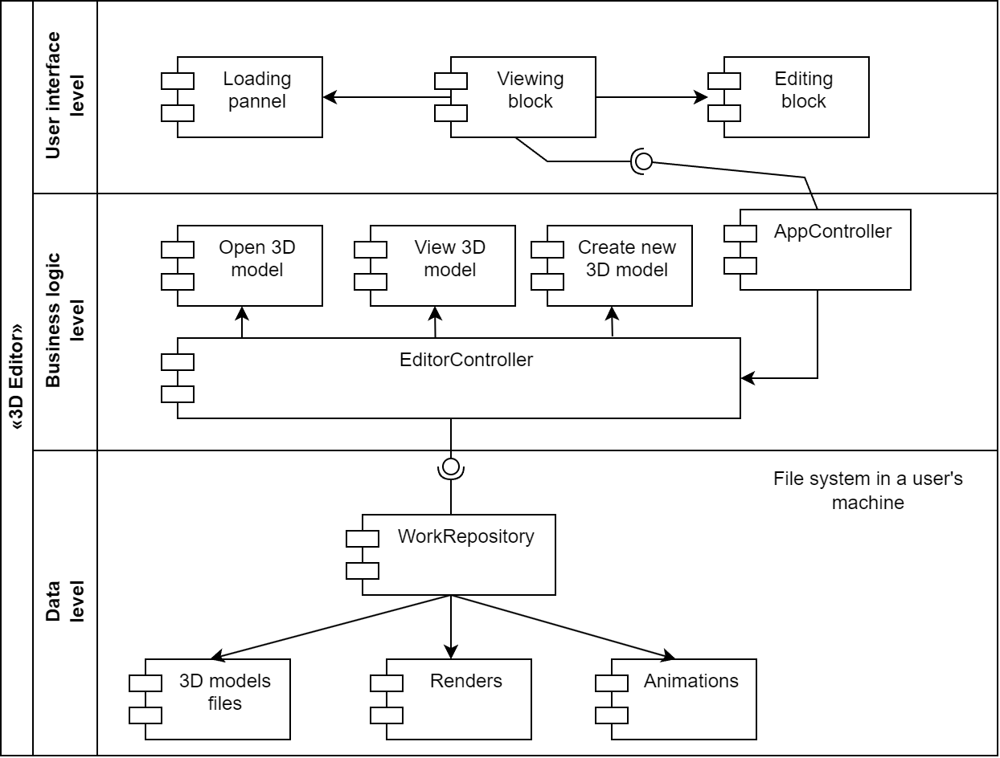
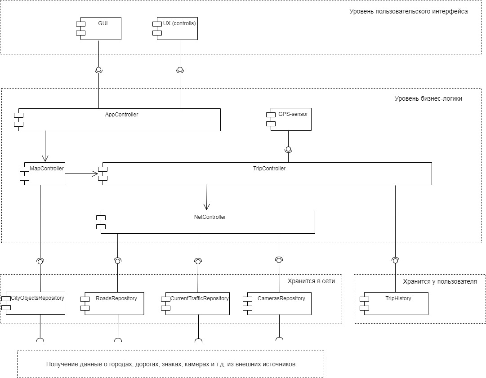

## Homework 5

1. Cформировать UML-диаграмму, отвечающей задаче: Необходимо разделить на горизонтальные уровни «Редактор 3D графики». Один пользователь. Программа работает на одном компьютере без выхода в сеть.

    - Что видит пользователь, как взаимодействует? (Панель загрузки, блок редактирования, блок просмотра …).
    - Какие задачи можно делать – функции системы? (Загрузить 3D модель, рассмотреть 3D модель, создать новую, редактировать вершины, текстуры, сделать рендер, сохранить рендер… ).
    - Какие и где хранятся данные? (файлы 3D моделей, рендеры, анимация .., в файловой системе компьютера).

Предложить варианты связывания всех уровней – сценарии использования. 3-4 сценария. Сквозная функция – создать новую 3D модель, сделать рендер для печати на принтере

2. Реализовать архитектуру из приложенной UML-диаграммы к уроку

